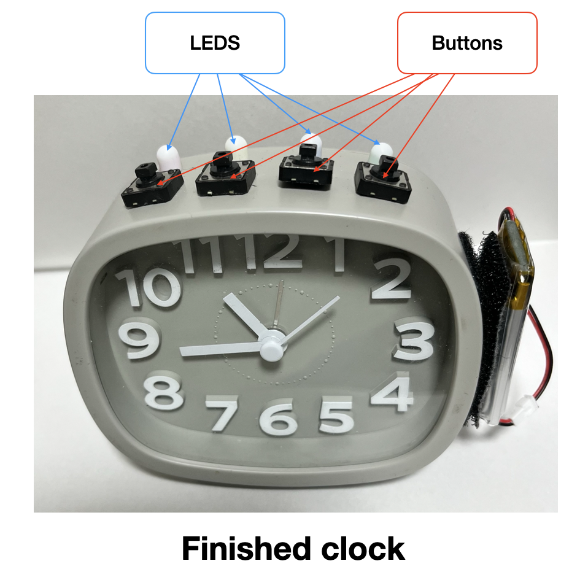

## Background

It is all too easy to turn a traditional alarm clock off and go back to sleep, without even opening your eyes.  
This project aimed to create an alarm clock that required the user to have their eyes open and for them to be alert to some extent to help reduce the chances of them going back to sleep after turning that alarm off.  
I also wanted the resulting alarm clock and all of its internals to fit into the body of an existing alarm clock.
I wanted the functionality of the alarm clock to be unaffected. I wanted the user to be able to set the clock, and prime the alarm in the same way that they would use the alarm clock without modification. I was mostly successful at this, but the new battery did not fit in the end.

## Project summary

I made modifications to a cheap alarm clock to make it do the following:  
1. If it detected the alarm was ringing, it would trigger a "puzzle" sequence where the user would need to press one of 4 buttons indicated by the adjecent LED turning on. (See attached figure below.  5 consecutive correct answers are required to complete the puzzle. Any errors result in the puzzle starting over, indicated by all the LED's flashing.  
2. Once activated, the alarm cannot be turned off by toggling the alarm switch at the back, and can only be turned off by entering the correct sequence of buttons, (or disconnecting the battery)  

See attached scans for schematics and connection details. (I prefer to write by hand sometimes)  

